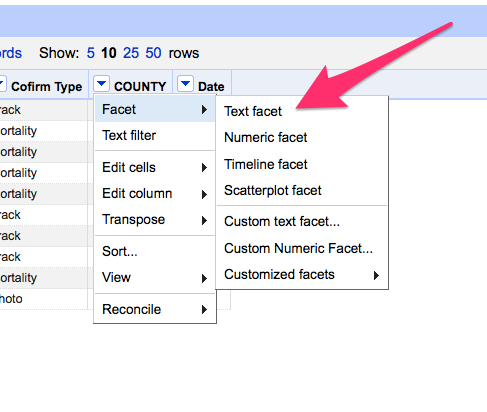
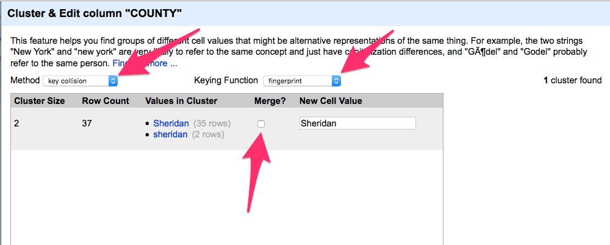
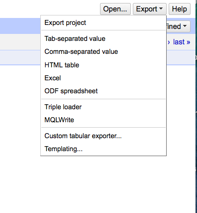

# Data normalization walkthrough

Data normalization is where you make sure all things are the same in data you need. In data, St. Petersburg, St Petersburg, St petersburg, ST Petersburg, St Petersberg and St Pete are all different things. When you need to do a count of each city, that's a bad, bad thing.

This begins you on a long road of interrelated problems and solutions that are all meant to get you where you need to go. Some data fixes can be done in a text editor -- one or two simple things. Some data fixes, particularly those you'll do over and over and over every month or every day even, should be programmed and run by a computer. And some fixes are made for Open Refine, a power tool that is very, very good at normalizing data.

Let's do a simple one first. Fire up Open Refine on your computer and then open a browser and go to [http://127.0.0.1:3333/](http://127.0.0.1:3333/). That'll take you to a web application running inside your computer -- Open Refine.

Click browse and find the Mountain Lion data we used in our Agate group-by walkthrough.

After we import it, we look at it and see it looks good, so we click Create Project.

With it imported, we look at the columns, and we see this dropdown menus. Click on the one next to County.

Open Refine works with Facets, which are collections of data -- think of them like Group Bys on acid. Counties are text, so we'll use a Text Facet.

Facets pop a box up on the left, and we want to Cluster them together, so click Cluster.

Using a variety of algorithms, Open Refines clusters things that appear to be alike together based on the outcome of those algorithms. There isn't a magic bullet here: you've got to try them out, sort through the results and make decisions.

This one is easy. Click Merge and then click the Merge checkbox and then Merge Selected and Close. Normally, you'd Merge Selected and Recluster to see if anything new is happening.

Now we export it out.  

# MAJOR RULE: Work from a copy. Do not alter the original file.

# Data normalization assignment
In this assignment, you must clean a file from the United States State Department on refugees resettled in the United States since 2002. We want to group the unique cities together and sum the total number of refugees resettled in them since 2002.

The city field is dirty. It contains mulitple entries for the same city.

1. [Download the file](https://www.dropbox.com/s/xphejlnbgm0hrva/refugees.csv?dl=0). The file you want is called refugees.csv.
2. Normalize the data using Open Refine. Specifically, the field you need to normalize is the city name.
4. Export your newly cleaned data into a new csv file.
5. Import your newly cleaned up data into Agate.
6. Group and sum by unique city name. Remember, there can be more than one city named something. So be sure you are adding the state to it.
7. Turn in your ipynb file and your csv file for credit. 
