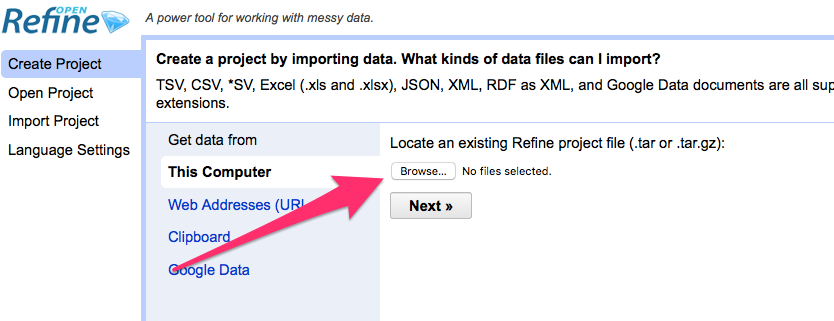
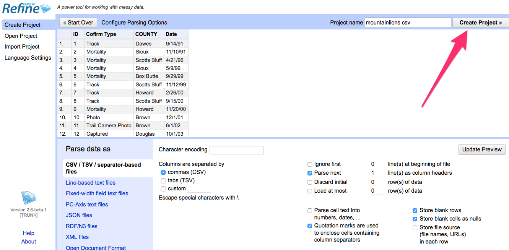
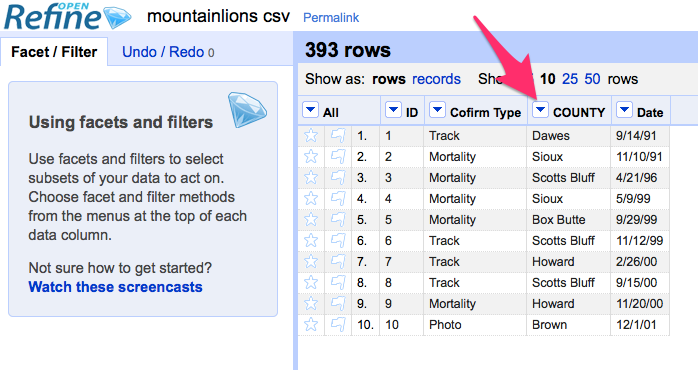
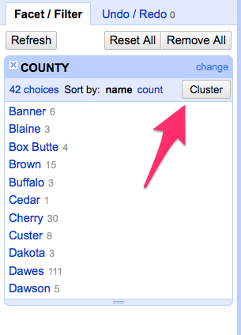

# Data normalization walkthrough

Data normalization is where you make sure all things are the same in data you need. In data, St. Petersburg, St Petersburg, St petersburg, ST Petersburg, St Petersberg and St Pete are all different things. When you need to do a count of each city, that's a bad, bad thing. 

This begins you on a long road of interrelated problems and solutions that are all meant to get you where you need to go. Some data fixes can be done in a text editor -- one or two simple things. Some data fixes, particularly those you'll do over and over and over every month or every day even, should be programmed and run by a computer. And some fixes are made for Open Refine, a power tool that is very, very good at normalizing data.

Let's do a simple one first. Fire up Open Refine on your computer and then open a browser and go to [http://127.0.0.1:3333/](http://127.0.0.1:3333/). That'll take you to a web application running inside your computer -- Open Refine. 

Click browse and find the Mountain Lion data we used in our Agate group-by walkthrough. 

After we import it, we look at it and see it looks good, so we click Create Project.

With it imported, we look at the columns, and we see this dropdown menus. Click on the one next to County.

Open Refine works with Facets, which are collections of data -- think of them like Group Bys on acid. Counties are text, so we'll use a Text Facet.

Facets pop a box up on the left, and we want to Cluster them together, so click Cluster.

Using a variety of algorithms, Open Refines clusters things that appear to be alike together based on the outcome of those algorithms. There isn't a magic bullet here: you've got to try them out, sort through the results and make decisions.

This one is easy. Click Merge and then click the Merge checkbox and then Merge Selected and Close. Normally, you'd Merge Selected and Recluster to see if anything new is happening. 

Now we export it out.  

# MAJOR RULE: Work from a copy. Do not alter the original file.

So lets do a much more complicated one. This one is specific to your assignment. 

First, from your command prompt:

**MAC USERS**: source activate homework (or whatever you called your environemnt)

**PC USERS**: fire up Git Bash.

`pip install csvkit`

CSVKit is an awesome tool for turning all kinds of junk into a CSV file. 

Go here: [http://www.deq.state.ne.us/lustsurf.nsf/pages/sssi](http://www.deq.state.ne.us/lustsurf.nsf/pages/sssi)

Download spillfac.csv. Move it from your Downloads folder into your Home directory. 

IF you really want to, you can try to just import this into Agate. You'll find that it has non-UTF-8 characters in it. There's an easy way to fix this: CSVKit.

Open spillfac.csv in Excel and save it as an Excel file called lust.xslx. That's right, we WANT it to be an Excel file. 

Then, on the command line, we are going to run a command:

`in2csv lust.xlsx > lust.csv`

If things worked, you should now have a lust.csv file that is UTF-8 compliant. 

Now let's open that up in Open Refine and use some different clustering. 

# Data normalization assignment
In this assignment, you must take a file from the Nebraska Department of Environmental Quality and make it useful. I want to know how many leaking underground storage tanks there are in each city in Nebraska. 

Yes, the acronym for leaking underground storage tanks is LUST.

To do this, you will need to:
1. [Get the file from the DEQ](http://www.deq.state.ne.us/lustsurf.nsf/pages/sssi). The file you want is called spillfac.csv, but keep this page handy because it has some filter conditions you're going to need.
2. The file that comes from the state is not UTF-8. Follow the walkthrough. Use Excel and csvkit to zap the non-UTF-8 characters.
3. Normalize the data using Open Refine. Specifically, the fields you need to normalize are the owner company -- OWNCO -- and the city the tank is in -- SPCITY.
4. Export your newly cleaned data into a new csv file.
5. Import your newly cleaned up data into Agate.
6. Filter out any leaking underground storage tanks that aren't leaking. (see the documentation from where you downloaded the file)
5. Group it by the OWNCO and count them. 
6. Sort it.
7. Print the top 20 to the screen.

