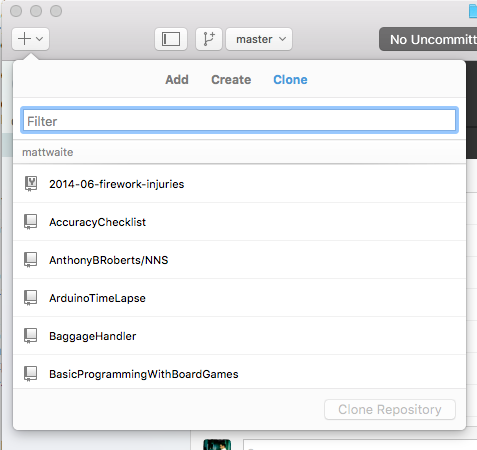
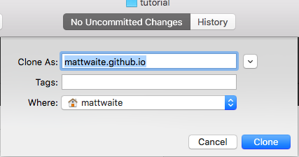
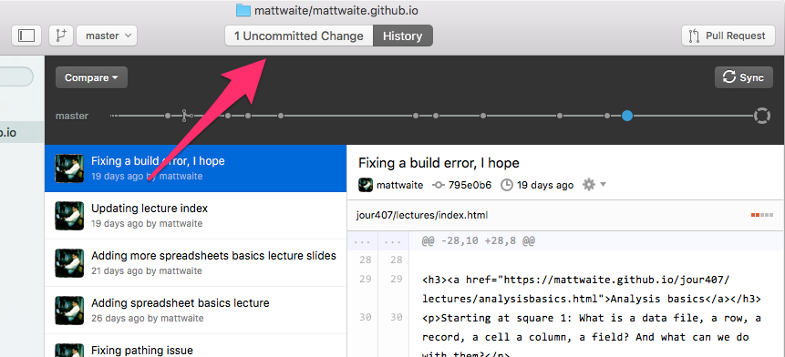
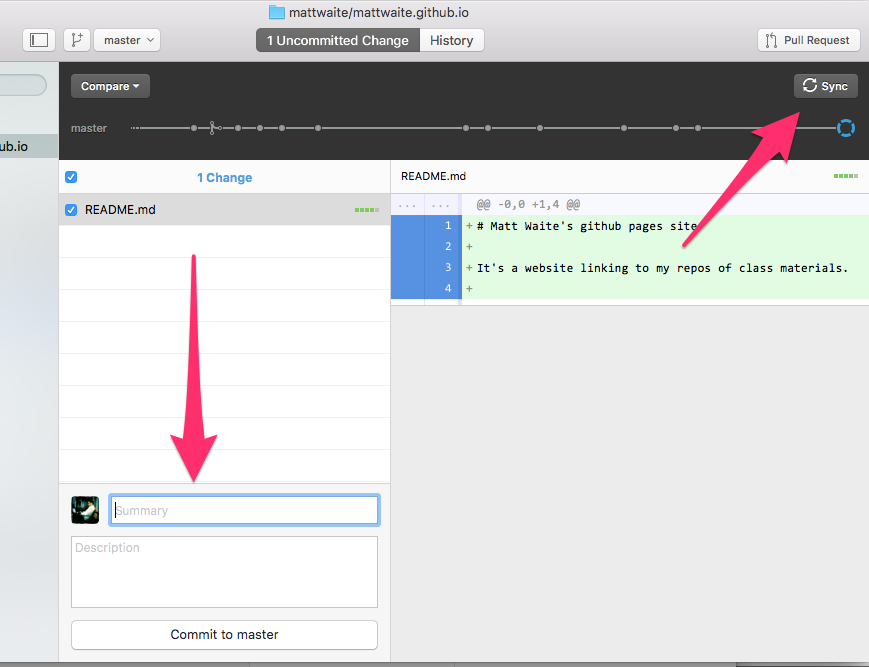

# GitHub for Beginners

We're witnessing the realization of an less-understood portion of Phil Meyer's vision for Precision Journalism. Indeed, it was #2 on his list of Things Journalists Share with Scientists. 

> Openness. The key word is "replicability." A good investigative reporter documents his search for truth, making a paper trail that other investigators can follow to reach the same conclusions.

Before now, our systems for creating this openness was publication. Many considered publishing the story to be sufficient. When the analysis became more complex, we created the "Nerd Box", which was a sidebar story that explained, in general terms, what the analysis was and how it was done. Few, if any, ever included code or a real step-by-step documentation of the process. The argument, from editors, was that few people would care enough to know. 

But the advent of the internet has done away with the main barrier to being truly open with analysis as the Scientific Method demands: The cost of reaching the few people who would care. Newsprint costs money. Airtime on a 30 minute broadcast costs money. It made no sense to spend that money on such a small audience. But the internet has no such space limitation. And rigor demands that you give people enough information to replicate what you've done. 

Jupyter Notebooks and GitHub are the way we will do this. News organizations are already doing this with increasing frequency. Knowing how to do this will give you a leg up. 

### Examples

Let's just get this out of the way: [With Jupyter Notebooks and open data, you can prove Einstein correct and discover freaking gravity waves](https://losc.ligo.org/s/events/GW150914/GW150914_tutorial.html). Droppin' science like Galileo dropped the orange.

* [BuzzFeed's repository is amazing](https://github.com/BuzzFeedNews/everything)
* [FiveThirtyEight's is right up there as well](https://github.com/fivethirtyeight/data)
* [The Washington Post's Police Killings database updates daily](https://github.com/washingtonpost/data-police-shootings/)
* [NPR not only made military gear going to police data available](https://github.com/nprapps/leso) they [explained in depth why they did what they did](http://blog.apps.npr.org/2014/09/02/reusable-data-processing.html).

### To create a new repository

First: Go to [GitHub.com](https://github.com/) and create an account, if you haven't already.

GitHub is a social code sharing and version control platform. What you put on GitHub is open for all to see (unless you buy an account that allows private repos). You can see other's code, they can see yours. People can help you, and you can help other people. Sometimes what you need to get over the hump is to see what others have done. Sometimes, people get interested in what you are doing and will jump in and make suggestions about your code. It's a really neat platform. 

The main feature of GitHub is the Repository. It's a place for your stuff. We're going to create one called jour407homework and that's where you're going to store stuff from now on. 

Your first time on Github, your page looks different from one I can show you. But on the right side, down a ways, you should find a button that looks like this:

Click that and then:

1. Name your repository jour407homework.
2. Write a short description.
3. Select Initialize this repository with a README.

### Download and install GitHub Desktop

**My honest opinion is the best way to interact with GitHub is on the command line, but if you're not accustomed to that, it can be a steep learning curve.**

[You can download and install GitHub Desktop here](https://desktop.github.com/). Follow the instructions to download and install it. When you do, start the program up and set it up by adding your username and password for GitHub into the Desktop app. 

### To copy the repository locally

The great thing about GitHub is that you can work locally and store your code in the cloud. It's both a way to mark progress and back things up elsewhere. If you check your code in often, you'll have a record of what you've done AND a backup in case something happens on your local computer. 

The process of copying something locally is called Cloning. You're making a `clone` of what's online to your local computer and you'll `commit` changes to the log and `push` changes to your repository. 

Let's clone our repository that we've created. Click the plus button on the top left and then click Clone. It should find your repository. Click it and clone it. 

Once we've clicked on it, it'll ask us where we want to put it: You decide:

### Edit a file, commit the changes

Let's open up README in a text editing program (**NOT MICROSOFT WORD**) and change it. We'll add some details. After you've done that, click back on GitHub Desktop. You'll see now you have uncommitted changes.

So click that button, and you'll see what you're about to commit. Down in the box below, add a commit message. Summarize what you've done, so you can identify what you did this commit. The more explicit you are the better. [Example](https://github.com/plattebasintimelapse/pbt-potd/commit/0d452143d7081e9fc9dbccc34d296fa332e43b8a)

Once you have added a commit message, click Commit To Master. That commits the changes, but they're only stored locally. To finish the job, you have to click Sync.

## Assignment

1. Inside the folder where your jour407homework resides on your computer -- probably called jour407homework -- add a new folder called DataNormalizationHomework.
2. In that folder, copy your lust data that you used to finish the homework -- the one you cleaned with open refine. 
3. In that folder, copy your iPython notebook (the ipynb file).
4. In GitHub Desktop, create a commit with a message saying what you're doing. Commit it.
5. Push that commit to Github. 
6. Go to GitHub.com and copy the URL to your repository.
7. Submit the URL to your repository to Blackboard.

All of your story assignments will be handled this way. You'll add your data that you used and your Agate code and explanations to analyze it to a folder and commit it to this repository.

