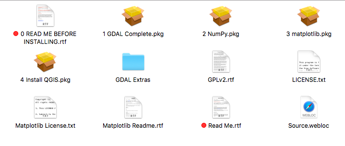

# Installing QGIS

Unfortunately, installing QGIS is not completely straightforward for Mac Users. It's one of the few times when Window's users have an advantage.

## Step 1

[Download the installer for your operating system](https://www.qgis.org/en/site/forusers/download.html). We want the latest version. 

**Mac Users**: You will be taken to a different page where you'll download a Mac installer.

## Step 2

** Windows Users **: Double click the installer and follow the onscreen instructions.

** Mac Users **: QGIS requires several libraries in order to function. YOU MUST INSTALL THEM BEFORE YOU INSTALL QGIS. And you must install them IN ORDER. And, depending on your security setup, your OS X version may not allow you to install them by just double clicking. If you double click on the installer named 1 GDAL Complete.pkg and it says you can't install it, you'll need to hold control and click on the installer and go to Open. It will then allow you to install it. 

FOLLOW THE NUMBERS. 1, then 2, then 3, then 4. 

## Step 3

Verify your installation by opening up QGIS.